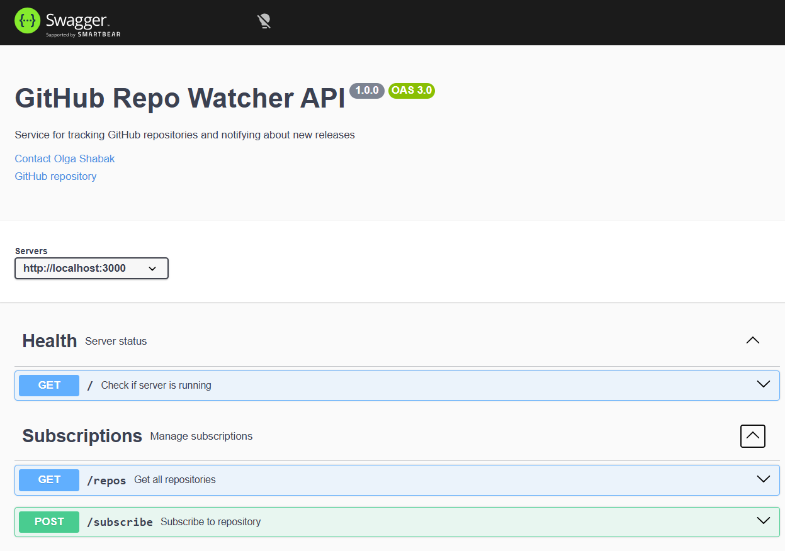

# GitHub Repo Watcher API

Backend service for subscribing to GitHub repositories and tracking new releases.

---

## 🚀 Live Demo

Deployed API:  
https://github-repo-watcher-for-gen.onrender.com  

Swagger UI:  
https://github-repo-watcher-for-gen.onrender.com/api-docs  

---

## Demo (Local)

Swagger UI:  
http://localhost:3000/api-docs

---

## Screenshot

---

## Features

- Subscribe to GitHub repositories
- Automatically track latest tags
- Store subscriptions in SQLite database
- Background scanner checks updates every minute
- REST API with Swagger documentation

---

## Notifications

Email notifications are sent when a new release is detected.  
For testing, Ethereal email service is used.

---

## Tech Stack

- Node.js
- Express
- SQLite (better-sqlite3)
- Swagger (OpenAPI 3.0)
- Axios

---

## How to run

npm install  
node server.js  

Server will start at:  
http://localhost:3000  

---

## Docker

Basic Docker setup is provided.

To run with Docker:

docker-compose up --build

Note: Docker setup was not fully tested locally

---

## API Documentation

Open Swagger UI in browser:  
http://localhost:3000/api-docs  

---

## API Endpoints

### Health
GET / — Check if server is running  

### Subscriptions
GET /repos — Get all subscriptions  

POST /subscribe — Add new subscription  

---

## Example request

POST /subscribe

{
  "email": "test@gmail.com",
  "repo": "facebook/react"
}

---

## How it works

1. User subscribes to a repository via API  
2. Data is stored in SQLite database  
3. Background scanner runs every 60 seconds  
4. Latest GitHub tag is fetched via GitHub API  
5. If a new tag appears — user receives email notification  

---

## Database

SQLite database (`database.db`) stores:

- id  
- email  
- repo  
- last_seen_tag  

---

## Notes

- Server must be running to access Swagger UI  
- Repository format must be: `owner/repo`  
- Returns 400 if format is invalid  
- Returns 404 if repository not found  
- Uses GitHub public API for fetching tags  
- SQLite is implemented using better-sqlite3 for compatibility with deployment environments  

---
## Web Interface

A simple web interface is available:

https://github-repo-watcher-for-gen.onrender.com

Allows users to:
- Enter email
- Enter repository (owner/repo)
- Subscribe without using Swagger UI

---

## Author

Olga Shabak